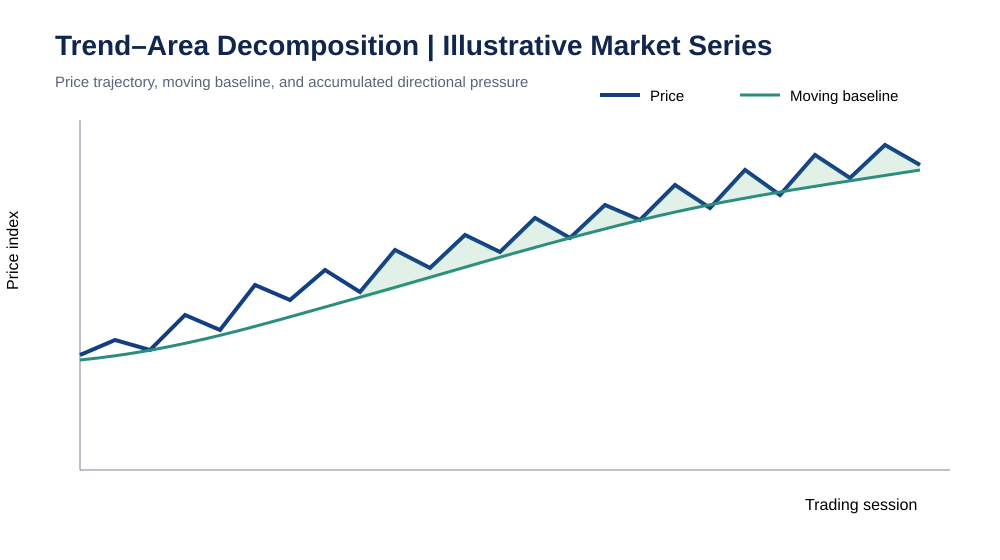
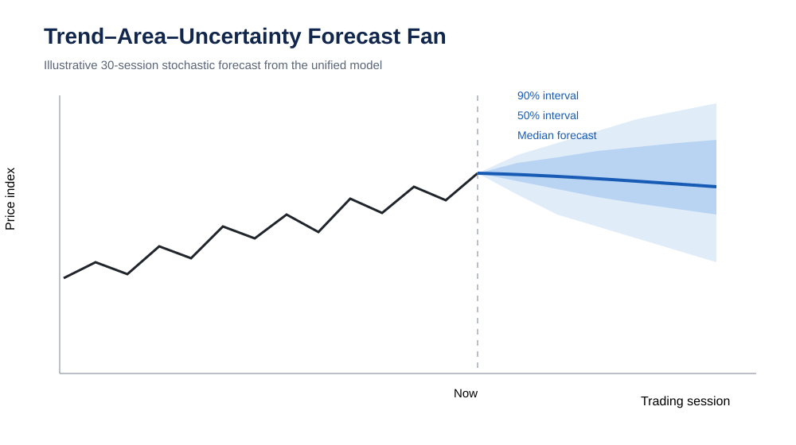
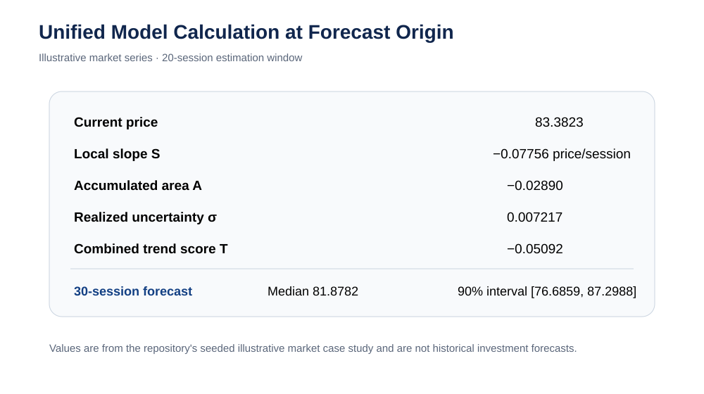

# Financial Algorithms: Optimization, Valuation & Market Prediction

A quantitative-finance modeling framework combining **portfolio optimization**, **valuation under uncertainty**, and **probabilistic market-trend analysis**. The project is designed around reproducible numerical experiments, explicit constraints, uncertainty quantification, and benchmark comparison.

| Model | Purpose | Core method | Output |
|---|---|---|---|
| **Portfolio Optimization** | Allocate capital under risk and realistic constraints | Simulated Annealing + SLSQP | Portfolio weights, risk/return profile |
| **Financial Valuation & Risk** | Estimate value under uncertain future cash flows | DCF + Monte Carlo | Intrinsic-value distribution, P10/P50/P90 |
| **Trend–Area–Uncertainty Forecasting** | Measure directional price pressure and forecast uncertainty | Slope + accumulated area + probabilistic model | Direction probability and uncertainty |

## 1. Quantitative Finance & Portfolio Optimization

$$U(w)=\mu^T w-\frac{\gamma}{2}w^T\Sigma w$$

subject to $\sum_i w_i=1$ and $w_i\geq0$. The non-convex implementation additionally accounts for turnover, transaction cost, cardinality and minimum-position effects. Simulated Annealing explores portfolio supports globally; SLSQP performs constrained local refinement.

### Portfolio optimization benchmark


Hybrid SA→SLSQP mean utility: **0.11915**, 95% bootstrap interval **[0.11710, 0.12110]**, across 30 controlled markets.

## 2. Financial Valuation & Risk Modeling

$$V=\sum_{t=1}^{n}\frac{CF_t}{(1+r)^t}+\frac{CF_n(1+g)}{(r-g)(1+r)^n},\qquad r>g.$$

Monte Carlo simulation propagates uncertainty through future cash flows and produces a valuation distribution instead of a single deterministic estimate.

### Monte Carlo DCF convergence


50,000-path reference: **P10 1054.17 · P50 1376.21 · P90 1837.07**.

## 3. Unified Trend–Area–Uncertainty Forecast Model

The model connects three ideas: **what price is doing now**, **what directional pressure has accumulated**, and **how uncertain the next movement remains**.

### Architecture

**Price Data → Slope → Accumulated Area Pressure → Trend Score → Gaussian/Stochastic Uncertainty → Forecast**

$$S_t=\frac{\Delta P}{\Delta t}$$

$$A_t=\int_{t-W}^{t}[P(\tau)-M(\tau)]\,d\tau$$

$$T_t=w_1S_t+w_2A_t$$

$$P_{t+h}=P_t+T_t+\sigma_t Z,\qquad Z\sim\mathcal N(0,1).$$

The executable probability model uses volatility-normalized log-price slope, short/medium momentum and integrated displacement to estimate $P(P_{t+h}>P_t\mid x_t)$.

### Stock-style worked example

A reproducible market-like price series is included to show exactly how the calculation behaves. It is deliberately labeled **illustrative**, rather than being passed off as historical market evidence.

For a 20-session window ending at time $t$:

1. Fit the local log-price slope $S_t$.
2. Compute the moving baseline $M_t$.
3. Integrate the signed displacement $P-M$ to obtain area pressure $A_t$.
4. Normalize the terms to comparable price/time units.
5. Combine them into $T_t$.
6. Estimate recent log-return volatility $\sigma_t$.
7. Simulate future paths using the trend term plus stochastic shocks.
8. Report the median path and uncertainty intervals rather than one falsely precise target.

The calculation script is [`scripts/stock_case_study.py`](scripts/stock_case_study.py). Running it produces three presentation figures:

**Trend and accumulated pressure.** Price is shown against its moving baseline; filled regions expose positive and negative accumulated pressure.



**Forecast uncertainty fan.** Thousands of stochastic paths are summarized by the median trajectory and 50%/90% uncertainty intervals.



**Model-component calculation.** The final observation decomposes slope, accumulated pressure, realized uncertainty and combined trend score.



### Controlled validation


Controlled persistence skill: **+0.0170 [0.0077, 0.0259]**. Random-walk control: **−0.0107 [−0.0178, −0.0031]**. The negative control tests whether the method manufactures apparent signal when none was introduced.

## Benchmark summary

| Experiment | Result |
|---|---:|
| Equal-weight non-convex utility | 0.07347 [0.07204, 0.07489] |
| SLSQP on complete non-convex objective | 0.11601 [0.11379, 0.11834] |
| Simulated Annealing | 0.11910 [0.11702, 0.12107] |
| **Hybrid SA→SLSQP** | **0.11915 [0.11710, 0.12110]** |
| Monte Carlo DCF, 50,000 paths | **P10 1054.17 / P50 1376.21 / P90 1837.07** |
| Trend controlled-signal skill | **+0.0170 [0.0077, 0.0259]** |
| Trend random-walk control | **−0.0107 [−0.0178, −0.0031]** |
| Integrated numerical tests | **10/10 passed** |

## Validation

The project evaluates feasibility, the complete non-convex portfolio objective, global versus local optimization, DCF monotonicity, Monte Carlo reproducibility and convergence, probability bounds, out-of-sample trend behavior, explicit random-walk controls, multi-seed experiments and bootstrap confidence intervals.

Real-market performance evaluation additionally requires frozen historical datasets, untouched test periods, survivorship-aware universes, realistic fees/slippage and rolling or expanding estimation windows.

## Reproduce

```bash
python -m pip install -e '.[test]'
pytest -q
MPLBACKEND=Agg python scripts/academic_benchmark.py
MPLBACKEND=Agg python scripts/stock_case_study.py
```

## License

Released under the **MIT License**. See [`LICENSE`](LICENSE).

## Disclaimer

Quantitative-finance research software. Not investment advice. No guarantee of financial performance.