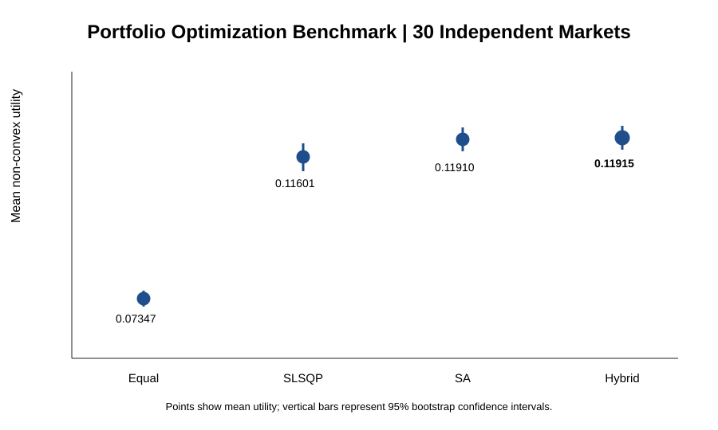
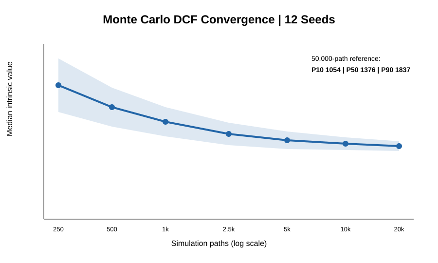
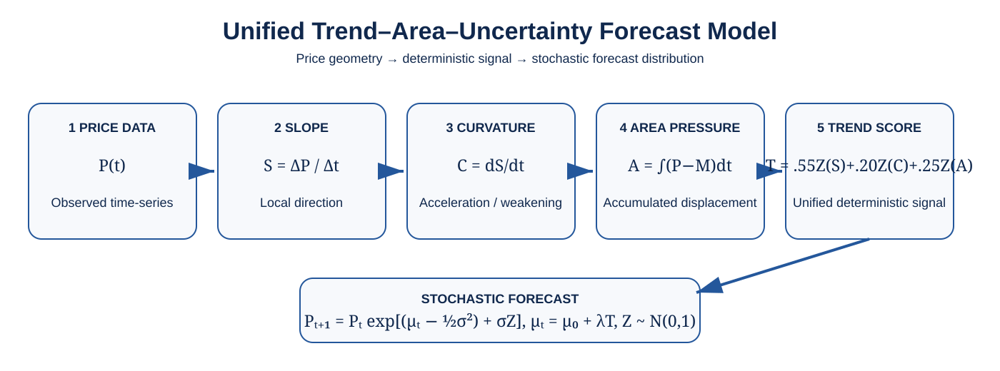
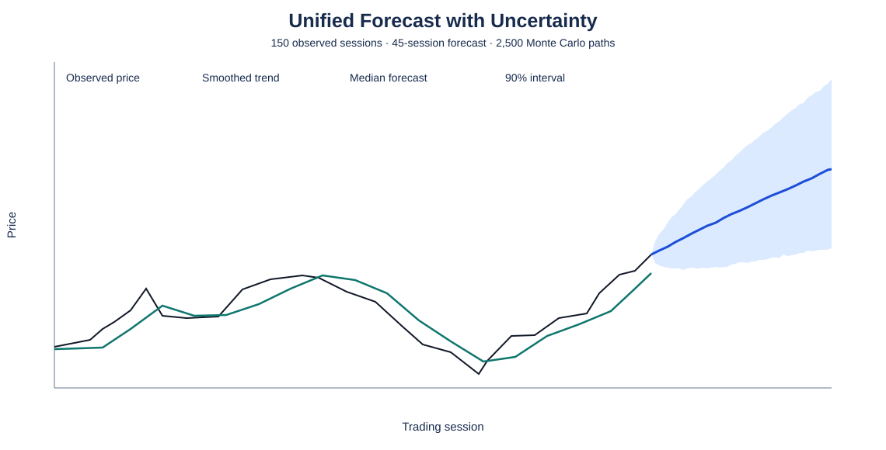
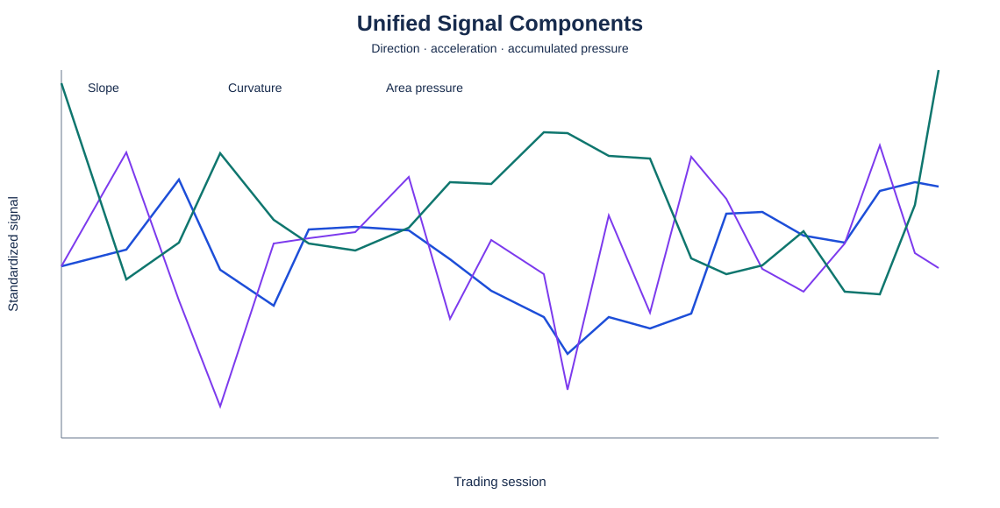
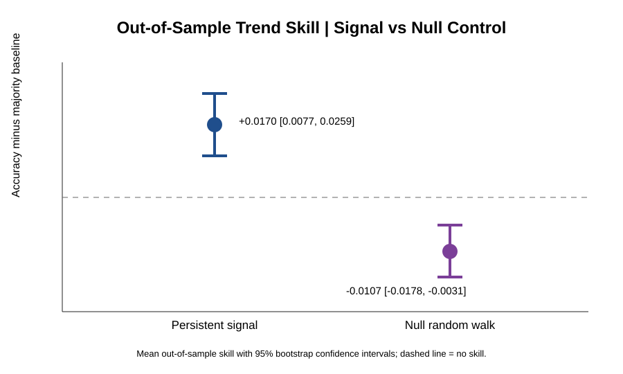

# Financial Algorithms: Optimization, Valuation & Market Prediction

A quantitative-finance modeling framework combining **portfolio optimization**, **valuation under uncertainty**, and **probabilistic market-trend analysis**.

| Model | Purpose | Core method | Output |
|---|---|---|---|
| **Portfolio Optimization** | Allocate capital under risk and realistic constraints | Simulated Annealing + SLSQP | Portfolio weights, risk/return profile |
| **Financial Valuation & Risk** | Estimate value under uncertain future cash flows | DCF + Monte Carlo | Intrinsic-value distribution, P10/P50/P90 |
| **Trend–Area–Uncertainty Forecasting** | Resolve direction, acceleration, accumulated pressure and uncertainty | Slope + curvature + area + stochastic forecast | Forecast distribution and signal decomposition |

## 1. Quantitative Finance & Portfolio Optimization

$$U(w)=\mu^T w-\frac{\gamma}{2}w^T\Sigma w$$

subject to $\sum_iw_i=1$ and $w_i\geq0$. The non-convex implementation additionally accounts for turnover, transaction cost, cardinality and minimum-position effects. Simulated Annealing explores portfolio supports globally; SLSQP performs constrained local refinement.



Hybrid SA→SLSQP mean utility: **0.11915**, 95% bootstrap interval **[0.11710, 0.12110]**, across 30 controlled markets.

## 2. Financial Valuation & Risk Modeling

$$V=\sum_{t=1}^{n}\frac{CF_t}{(1+r)^t}+\frac{CF_n(1+g)}{(r-g)(1+r)^n},\qquad r>g.$$

Monte Carlo simulation propagates uncertainty through future cash flows and produces a valuation distribution instead of a single deterministic estimate.



50,000-path reference: **P10 1054.17 · P50 1376.21 · P90 1837.07**.

## 3. Unified Trend–Area–Uncertainty Forecast Model

The unified model separates price motion into complementary signals: **direction**, **acceleration**, **accumulated displacement from baseline**, and **stochastic uncertainty**.

### Architecture



$$S_t=\frac{\Delta P}{\Delta t},\qquad C_t=\frac{dS}{dt}=\frac{d^2P}{dt^2},\qquad A_t=\int(P-M)\,dt.$$

The standardized signals are combined as

$$T_t=0.55Z(S_t)+0.20Z(C_t)+0.25Z(A_t).$$

The stochastic forecast is

$$P_{t+1}=P_t\exp\left[(\mu_t-\tfrac12\sigma^2)+\sigma Z_t\right],\qquad Z_t\sim N(0,1),$$

with $\mu_t=\mu_0+\lambda T_t$.

### Demonstration configuration

| Quantity | Value |
|---|---:|
| Historical observations | **150 sessions** |
| Forecast horizon | **45 sessions** |
| Monte Carlo paths | **2,500** |
| Baseline daily log-return $\mu_0$ | **0.0019567** |
| Trend-adjusted forecast drift $\mu_t$ | **0.0032654** |
| Estimated daily volatility $\sigma$ | **0.0100729** |
| Final unified trend score $T$ | **1.63580** |
| Signal weights | **0.55 slope / 0.20 curvature / 0.25 area** |

### Forecast with uncertainty



The widening interval visualizes uncertainty accumulation across the 45-session forecast horizon. The central trajectory is the median of 2,500 simulated paths.

### Signal decomposition



Slope measures current direction, curvature measures strengthening or weakening movement, and area pressure captures accumulated signed displacement relative to the moving baseline.

### Calculation flow

1. Smooth the observed price trajectory and estimate $M(t)$.
2. Compute $S_t=\Delta P/\Delta t$.
3. Compute $C_t=dS/dt$.
4. Integrate signed deviation from baseline to obtain $A_t$.
5. Standardize $S$, $C$ and $A$.
6. Form $T=0.55Z(S)+0.20Z(C)+0.25Z(A)$.
7. Estimate realized log-return volatility $\sigma$.
8. Shift baseline drift through $\mu_t=\mu_0+\lambda T$.
9. Generate 2,500 stochastic price paths.
10. Summarize the distribution with central forecast and uncertainty intervals.

### Controlled signal test



Controlled persistence skill: **+0.0170 [0.0077, 0.0259]**. Random-walk control: **−0.0107 [−0.0178, −0.0031]**.

## Benchmark summary

| Experiment | Result |
|---|---:|
| Equal-weight non-convex utility | 0.07347 [0.07204, 0.07489] |
| SLSQP on complete non-convex objective | 0.11601 [0.11379, 0.11834] |
| Simulated Annealing | 0.11910 [0.11702, 0.12107] |
| **Hybrid SA→SLSQP** | **0.11915 [0.11710, 0.12110]** |
| Monte Carlo DCF, 50,000 paths | **P10 1054.17 / P50 1376.21 / P90 1837.07** |
| Unified-model controlled-signal skill | **+0.0170 [0.0077, 0.0259]** |
| Random-walk control | **−0.0107 [−0.0178, −0.0031]** |
| Integrated numerical tests | **10/10 passed** |

## Reproduce

```bash
python -m pip install -e '.[test]'
pytest -q
MPLBACKEND=Agg python scripts/academic_benchmark.py
```

## License

Released under the **MIT License**. See [`LICENSE`](LICENSE).

## Disclaimer

Quantitative-finance research software. Not investment advice. No guarantee of financial performance.